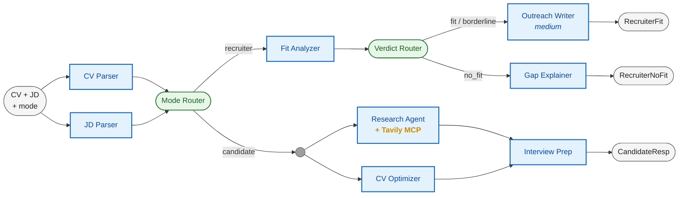

<h1 align="center">Career Copilot</h1>

<p align="center">
  A multi-agent CV × JD pipeline on Google ADK v2.
</p>

<p align="center">
  
  
  
  
  
  
  
  
</p>

<p align="center">
  <a href="https://career-copilot.najinajari.com">Live demo</a> ·
  <a href="https://najinajari.com/projects/career-copilot">Project write-up</a>
</p>

---

Career Copilot reads a CV against a job description and produces a different output depending on who is asking. Recruiters get a fit verdict and a LinkedIn outreach draft that quotes a real achievement from the CV. Candidates get a company brief researched live through Tavily MCP and a tailored interview-prep bundle.

The point of the project is the orchestration. Google ADK v2 shipped its graph workflow API recently, in the same spirit as LangGraph. This is an end-to-end test of it on a real use case.

## Why a graph

A single big-prompt agent works until you need any of: deterministic branching, parallel work, typed contracts at every step, or per-step tracing. Once you do, a graph stops being optional.

- **Explicit topology**: nodes, edges, parallel branches, conditional routing, and sync points are first-class.
- **Testable units**: each node can be tested, swapped, or traced in isolation.
- **Typed state**: contracts at every boundary instead of free-form prompt parsing.
- **Predictable cost**: you know upfront which steps run, in what order, and which model serves each.

## How it works



CV and JD are parsed in parallel. The mode router (a `FunctionNode`, not an LLM) splits the flow:

- **Recruiter branch**: linear chain. Fit Analyzer scores fit, Verdict Router routes to Outreach Writer (on fit / borderline) or Gap Explainer (on no_fit).
- **Candidate branch**: parallel fan-out. Research Agent (Tavily MCP) and CV Optimizer run concurrently, synchronize through a `JoinNode`, then feed Interview Prep.

Internal `JoinNode`s are omitted from the diagram for clarity. See [`app/agent/agent.py`](backend/app/agent/agent.py) for the full topology.

## Architecture decisions

The graph encodes a deliberate separation between deterministic control flow and LLM-driven generation. Routing and synchronization stay in pure Python; only generation crosses an LLM boundary, and every output is constrained by a Pydantic schema before it leaves a node.

- **Control flow stays out of the LLMs.** Routing lives in `FunctionNode`s that decide branches in pure Python on already-typed state. `JoinNode`s wait for parallel branches to complete before firing downstream. No LLM ever picks which branch fires next, which removes a whole class of failure modes from the critical path.
- **One schema per agent.** Each LLM agent declares its own `output_schema`. Invalid output fails the node loud and fast instead of corrupting state in a downstream agent.
- **Tool-use escape hatch.** ADK currently disallows combining `output_schema` with tools on `gpt-5.4-mini`. The Research Agent uses the Tavily MCP toolset and emits `CompanyIntelligence` as a JSON string, validated with `model_validate_json` at the API boundary so the typed-state invariant is preserved at the edge.

## Agents

All agents run OpenAI `gpt-5.4-mini` via `LiteLlm`. The Outreach Writer is the only one dialled up to medium reasoning effort.

| Agent              | Role      | Output schema             |
| ------------------ | --------- | ------------------------- |
| CV Parser          | Parser    | `ParsedCV`                |
| JD Parser          | Parser    | `ParsedJD`                |
| Fit Analyzer       | Recruiter | `FitVerdict`              |
| Outreach Writer    | Recruiter | `OutreachDraft`           |
| Gap Explainer      | Recruiter | `GapReport`               |
| Research Agent     | Candidate | `CompanyIntelligence`     |
| CV Optimizer       | Candidate | `CVOptimizationBundle`    |
| Interview Prep     | Candidate | `InterviewPrepBundle`     |

## API

Two stateless POST endpoints. The `/v1/analyze` handler returns a discriminated union typed per mode, so the client always knows the response shape:

```python
AnalyzeResponse = Union[
    RecruiterFitResponse,
    RecruiterNoFitResponse,
    CandidateResponse,
]


@router.post("/v1/analyze", response_model=AnalyzeResponse)
async def analyze(request: AnalyzeRequest) -> AnalyzeResponse:
    state = await run_agent(root_agent, initial_state)
    if request.mode == "recruiter":
        return _build_recruiter_response(state)
    return _build_candidate_response(state)
```

`/v1/extract-pdf` accepts a multipart upload, validates content-type and a 10 MB cap, and returns the concatenated page text.

## Observability

Every `/v1/analyze` request opens a parent agent observation in Langfuse. Sub-agent and tool calls nest under it as child spans, with inputs, outputs, latency, and token counts captured. Mode, model, version, and input sizes are propagated as trace attributes for fast filtering in the Langfuse UI.

```python
with langfuse.start_as_current_observation(
    name=f"analyze.{request.mode}",
    as_type="agent",
    input={"mode": request.mode, "cv_text": ..., "jd_text": ...},
), propagate_attributes(
    trace_name=f"career-copilot.analyze.{request.mode}",
    tags=["analyze", request.mode],
    metadata={
        "mode": request.mode,
        "model": PRIMARY_MODEL,
        "version": VERSION,
        "cv_chars": str(len(request.cv_text)),
        "jd_chars": str(len(request.jd_text)),
    },
):
    state = await run_agent(root_agent, initial_state)
```

## Stack

| Layer     | Stack                                                              |
| --------- | ------------------------------------------------------------------ |
| Backend   | Python 3.12, FastAPI, Google ADK v2, `uv`                          |
| Models    | OpenAI `gpt-5.4-mini` via `LiteLlm`                                |
| Research  | Tavily via MCP (`McpToolset`)                                      |
| Frontend  | Next.js 15, React 19, Tailwind v4, shadcn/ui, TanStack Query, Zod  |
| Tracing   | Langfuse                                                            |
| Deploy    | Docker (Cloud Run / Fly.io / HuggingFace Spaces)                   |

## Run it

### Prerequisites

- Python 3.12 with [uv](https://docs.astral.sh/uv/)
- An [OpenAI API key](https://platform.openai.com/api-keys) for `gpt-5.4-mini`
- A [Tavily API key](https://tavily.com) for the candidate-mode Research Agent

### Install and configure

```bash
cd backend
uv sync
cp .env.example .env   # fill in OPENAI_API_KEY and TAVILY_API_KEY
```

### Start the backend

```bash
uv run uvicorn app.main:app --reload --port 8080
```

API docs at <http://localhost:8080/docs>. Try `POST /v1/analyze` with `{"cv_text": "...", "jd_text": "...", "mode": "recruiter" | "candidate"}`.

### Run the tests

```bash
uv run pytest tests/ -q
```

## License

[MIT](./LICENSE)