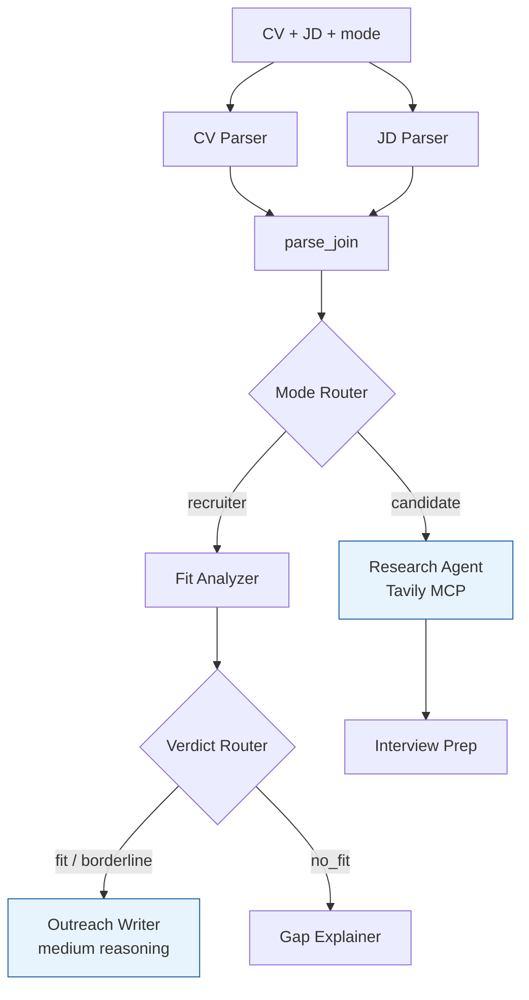

<h1 align="center">career-copilot</h1>

<p align="center">
  <strong>Paste a CV and a Job Description. Pick a mode. Get a real output in seconds.</strong>
</p>

<p align="center">
  
  
  
  
  
  
  
</p>

<p align="center">
  <a href="#what-it-does">What it does</a> ·
  <a href="#graph">Graph</a> ·
  <a href="#architecture">Architecture</a> ·
  <a href="#tech-stack">Tech stack</a> ·
  <a href="#setup">Setup</a> ·
  <a href="#running">Running</a>
</p>

---

Dual-mode AI tool built on Google ADK v2. Paste a CV and a Job Description, pick **Recruiter** or **Candidate** mode, and get a structured, grounded output — not generic AI filler.

## What it does

**Recruiter mode** — evaluates candidate fit against the JD. On fit / borderline, drafts a personalized LinkedIn outreach message citing a specific achievement from the CV. On no-fit, explains the gaps clearly and suggests adjacent roles.

**Candidate mode** — company research via Tavily MCP (funding, culture, Glassdoor, agency-posting detection) plus tailored interview prep (probable questions, talking points, smart reverse questions).

## Graph



CV and JD are parsed in parallel (independent extractions — halves preprocessing latency). `parse_join` synchronizes before the mode split. The `is_likely_agency_posting` signal is set during JD parsing (lexical hints) and confirmed by the Research Agent (web-sourced) in candidate mode.

## Architecture

Google ADK v2 graph-based `Workflow(edges=[...])`. Every LLM node has a typed Pydantic output schema — except the Research Agent, which uses tools (Tavily) and therefore cannot also enforce `output_schema` on gpt-5.4-mini; it returns a JSON string that the API handler validates with `CompanyIntelligence.model_validate_json`.

**Agents (LLM — OpenAI `gpt-5.4-mini` via LiteLlm)**
- **CV Parser** — `ParsedCV` (skills, years of experience, achievements, languages).
- **JD Parser** — `ParsedJD` (title, company, required/preferred skills, seniority, agency hints).
- **Fit Analyzer** — `FitVerdict` (fit / borderline / no_fit, confidence, matched evidence, gaps).
- **Outreach Writer** — higher reasoning effort. `OutreachDraft` citing a specific CV achievement.
- **Gap Explainer** — `GapReport` (gaps, explanation, adjacent roles).
- **Research Agent** — Tavily via MCP. Emits `CompanyIntelligence` as a JSON string.
- **Interview Prep** — `InterviewPrepBundle` (probable questions, talking points, reverse questions).

**Code nodes (no LLM)**
- `mode_router`, `verdict_router` — `FunctionNode`s that return `Event(route=...)`.
- `parse_join` — ADK `JoinNode` synchronizing the parallel parsers.

## Tech stack

| Layer    | Stack                                                           |
| -------- | --------------------------------------------------------------- |
| Backend  | Python 3.12, FastAPI, Google ADK v2, uv                         |
| Models   | OpenAI `gpt-5.4-mini` via `LiteLlm` (low reasoning by default, medium for Outreach Writer) |
| Research | Tavily via MCP (`McpToolset` + remote HTTP endpoint)            |
| Frontend | TBD — Next.js app coming next                                   |
| Deploy   | Dockerfile for Cloud Run / HuggingFace Spaces                   |

## Status

Active development, built incrementally.

- [x] Project structure + FastAPI backend boots
- [x] Pydantic schemas (ParsedCV, ParsedJD, FitVerdict, OutreachDraft, GapReport, CompanyIntelligence, InterviewPrepBundle, PrepBundle)
- [x] CV + JD parsers running in parallel with `JoinNode`
- [x] Recruiter branch (Fit Analyzer → Verdict Router → Outreach / Gap)
- [x] Tavily MCP integration
- [x] Candidate branch (Research Agent → Interview Prep)
- [x] `POST /v1/analyze` with discriminated response
- [x] Unit tests for routers
- [ ] Next.js frontend
- [ ] HuggingFace Spaces / Cloud Run deploy

## Setup

### Prerequisites

- Python 3.12 with [uv](https://docs.astral.sh/uv/)
- An [OpenAI API key](https://platform.openai.com/api-keys) for `gpt-5.4-mini`
- A [Tavily API key](https://tavily.com) for the candidate-mode research agent (MCP)

### Install

```bash
cd backend
uv sync
```

### Configure

```bash
cp backend/.env.example backend/.env   # fill in OPENAI_API_KEY and TAVILY_API_KEY
```

## Running

```bash
cd backend
uv run uvicorn app.main:app --reload --port 8080
```

API docs at http://localhost:8080/docs. Try `POST /v1/analyze` with `{"cv_text": "...", "jd_text": "...", "mode": "recruiter" | "candidate"}`.

## Tests

```bash
cd backend
uv run pytest tests/ -q
```

## License

[MIT](./LICENSE)
