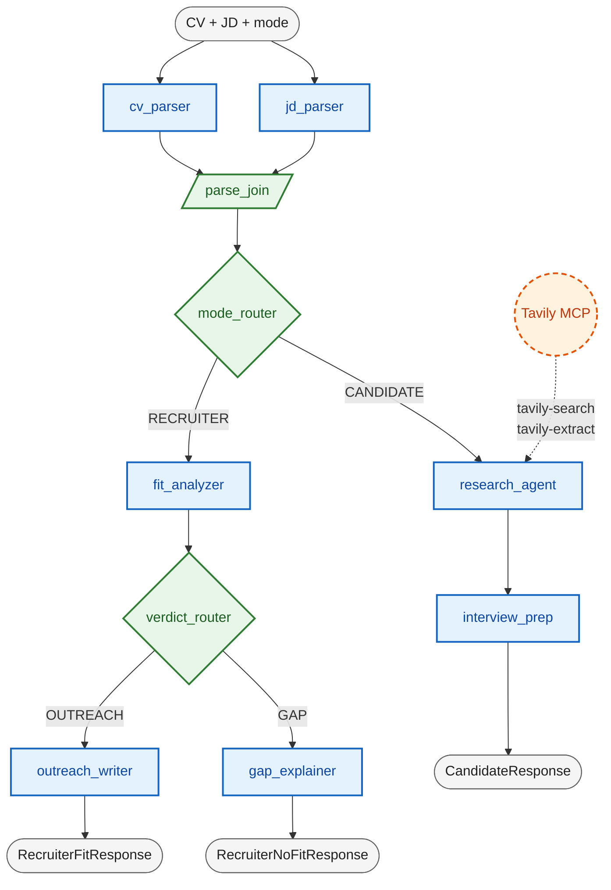

# career-copilot backend

FastAPI + Google ADK v2 graph workflow. Dual-mode CV + JD analyzer.

## Run

```bash
cp .env.example .env        # OPENAI_API_KEY + TAVILY_API_KEY
uv sync
uv run uvicorn app.main:app --reload --port 8080
```

- Health: http://localhost:8080/health
- Docs: http://localhost:8080/docs
- Endpoint: `POST /v1/analyze` — body `{cv_text, jd_text, mode}`, mode is `"recruiter"` or `"candidate"`.

## Tests

```bash
uv run pytest tests/ -q
```

## Layout

```
app/
├── main.py                          FastAPI app; mounts /v1/analyze
├── schemas.py                       All Pydantic (in + graph state + HTTP)
├── routes/analyze.py                POST /v1/analyze — preloads state, runs root_agent, composes response
├── agent/
│   ├── agent.py                     root_agent = Workflow(edges=[...])
│   ├── sub_agents/
│   │   ├── cv_parser/               ParsedCV
│   │   ├── jd_parser/               ParsedJD + agency hints
│   │   ├── fit_analyzer/            FitVerdict
│   │   ├── outreach_writer/         OutreachDraft (medium reasoning)
│   │   ├── gap_explainer/           GapReport
│   │   ├── research_agent/          CompanyIntelligence JSON (Tavily MCP)
│   │   └── interview_prep/          InterviewPrepBundle
│   ├── routers/
│   │   ├── mode_router.py           FunctionNode — reads state["mode"], returns Event(route=...)
│   │   └── verdict_router.py        FunctionNode — reads state["fit_verdict"], routes OUTREACH | GAP
│   └── tools/tavily_mcp.py          McpToolset factory (remote HTTP + StreamableHTTP params)
└── utils/
    ├── constants.py                 env vars (OPENAI_API_KEY, TAVILY_API_KEY, APP_NAME, USER_ID)
    ├── llm_utils.py                 openai_mini (low effort), openai_mini_med (medium)
    ├── adk_runner.py                run_agent(agent, initial_state) -> final state dict
    └── logger.py
```

## Data flow

1. `analyze()` builds `initial_state = {cv_text, jd_text, mode}` from the request.
2. `run_agent` creates a fresh `InMemorySessionService` + UUID session and preloads the state.
3. The `Workflow` runs nodes per the edge graph. Each `LlmAgent` reads state via instruction templating (`{cv_text}`, `{parsed_cv}`, …) and writes its result under `output_key`.
4. `run_agent` returns the full `session.state` dict; the route handler picks the keys it needs and builds the typed response (`RecruiterFitResponse` | `RecruiterNoFitResponse` | `CandidateResponse`).

Each HTTP request gets a brand-new session — no cross-request state contamination. Conversation memory could be added later by promoting the session service to app scope and reusing stable `session_id`s.

## Graph



Blue: LLM agents · green: pure-Python nodes (`FunctionNode` routers, `JoinNode`) · orange dashed: external tools via MCP · grey: HTTP I/O.

See `app/agent/agent.py` for the actual `edges=[...]`.

## Patterns / conventions

### LLM agents
- Always wrap models through `LiteLlm` — never pass a raw model name string. See `app/utils/llm_utils.py`.
- Use `output_schema=<Pydantic>` + `output_key=<state-key>` for structured outputs. Result lands in `session.state[output_key]` as a dict.
- Template state via `{key}` in the instruction. Missing keys raise unless you use `{key?}`.
- `output_schema` + `tools` is **incompatible** on gpt-5.4-mini (Gemini 3.0+ only). If you need tools, skip the schema and either (a) inline the JSON schema in the prompt and parse the string output later, or (b) add a parser agent downstream. Current code uses (a) for the Research Agent.

### FunctionNode routers
- Params bind from `ctx.state` by default. Name them to match state keys.
- Return `Event(route="LABEL")` (convenience kwarg → `event.actions.route`). The edge dict maps labels to target nodes.
- Keep these pure — no I/O, no LLM.

### Tools
- Prefer MCP toolsets over SDK wrappers. See `tools/tavily_mcp.py` — `McpToolset` + `StreamableHTTPConnectionParams`.
- Instantiate tolerantly: if a key is missing, log a warning and let the error surface at tool-call time instead of killing imports.

### Schemas
- All Pydantic models live in `app/schemas.py`. No per-agent schema files.
- Use `Literal` for closed enums (`Mode`, `Verdict`).

### State keys
- Inline string literals — no `session_keys.py` module. Keys are trivial enough that an index file adds more cost than value.

## Add a new LLM agent

1. Create `app/agent/sub_agents/<name>/{agent.py, prompt.py, __init__.py}`.
2. In `prompt.py`: define `<NAME>_INSTRUCTION`, reference state via `{key}`.
3. In `agent.py`:
   ```python
   from google.adk import Agent
   from app.schemas import OutputSchema
   from app.utils.llm_utils import openai_mini

   my_agent = Agent(
       name="my_agent",
       description="...",
       model=openai_mini,
       instruction=MY_INSTRUCTION,
       output_schema=OutputSchema,
       output_key="my_output",
   )
   ```
4. In `__init__.py`: `from .agent import my_agent; __all__ = ["my_agent"]`.
5. Wire into `app/agent/agent.py`'s `edges=[...]`.
6. If your output needs to be returned to the caller, read `state["my_output"]` in `app/routes/analyze.py` and add it to the response schema.

## Tavily MCP

Remote HTTP endpoint, key as query parameter:

```python
McpToolset(
    connection_params=StreamableHTTPConnectionParams(
        url=f"https://mcp.tavily.com/mcp/?tavilyApiKey={TAVILY_API_KEY}",
    ),
    tool_filter=["tavily-search", "tavily-extract"],
)
```

Stdio fallback documented in `tools/tavily_mcp.py` (requires `npx`).

## Known constraints

- **ADK 2.0 is alpha** (`google-adk>=2.0.0a0`). API may drift — pin exactly when stabilising.
- **`Event.route` does not exist** directly; it is a convenience kwarg on `Event(...)` that writes to `event.actions.route`. Router tests assert on `.actions.route`.
- **`output_schema` + tools**: see LLM agents pattern above.
- **LiteLLM Gemini warning**: suppressed — we deliberately route everything through LiteLlm for provider flexibility, Gemini path included.
